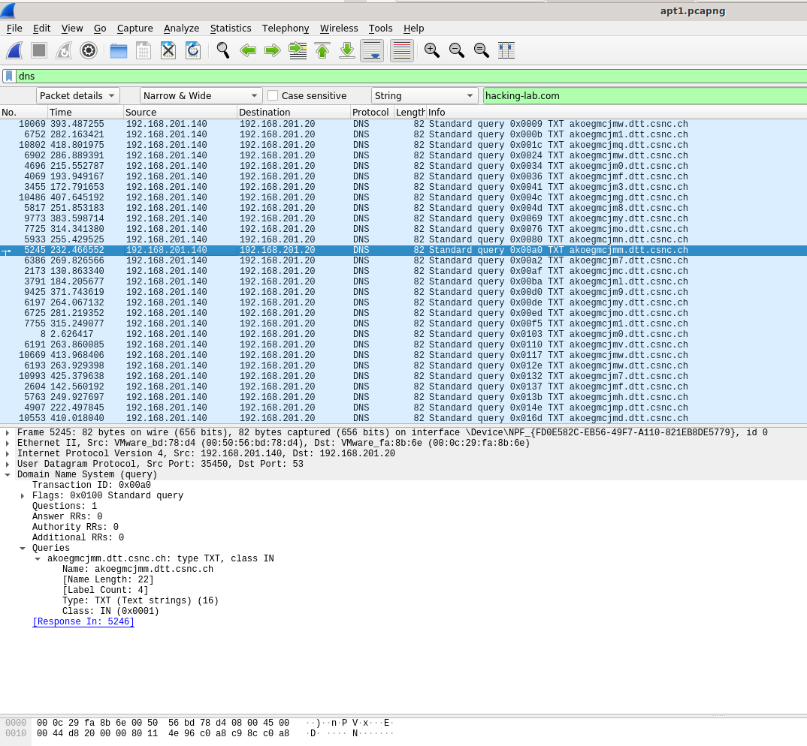
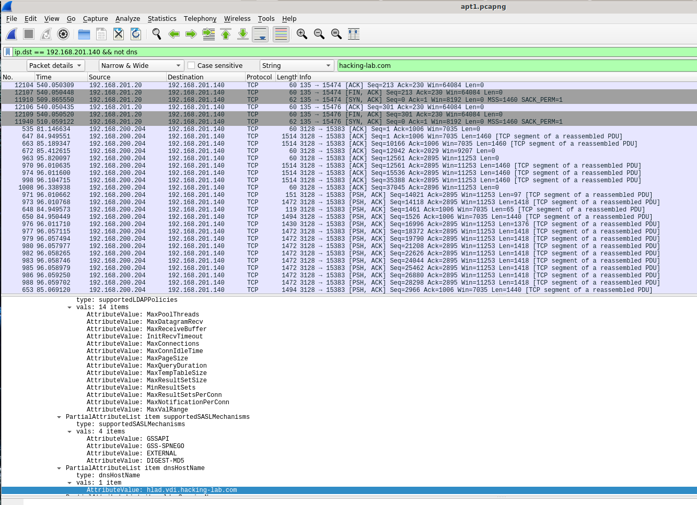
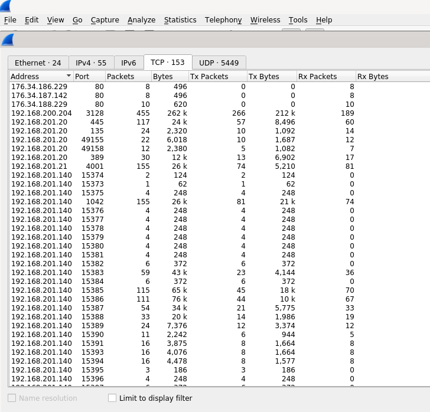

# APT1-Task
* Beschreibung von drei (3) Aufgaben mit der Datei `apt1.pcapng`

## Task 1: Anonymize DNS Tunnel
* There is a dns tunnel running in the pcap
* the domain is set to <random>.dtt.csnc.ch
* please replace dtt.csnc.ch with dtt.example.com

## Task 2: Anonymize Windows Protocol 
* there is some Windows (SMB) Protocol in the pcap
* the Windows Domain is set to `hacking-lab.com`  and several other `*.vdi.hacking-lab.com `domains
* please anonymize Windows Domain in pcap
* replace Windows Domain with `windowsdomain.com`

## Task 3: Replace IP Addresses
* we want to hide the real ip in our pcap
* please replace the prefix of the ip with something else
* 192.168.201 should go to 10.0.201
* 192.168.200 should go to 10.0.200

